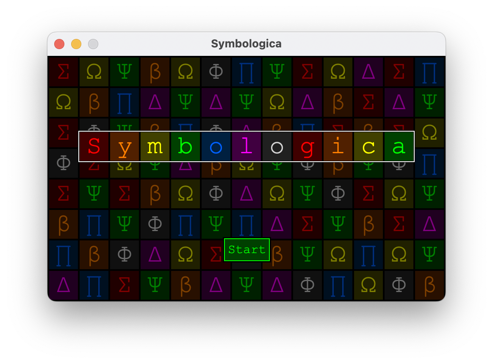
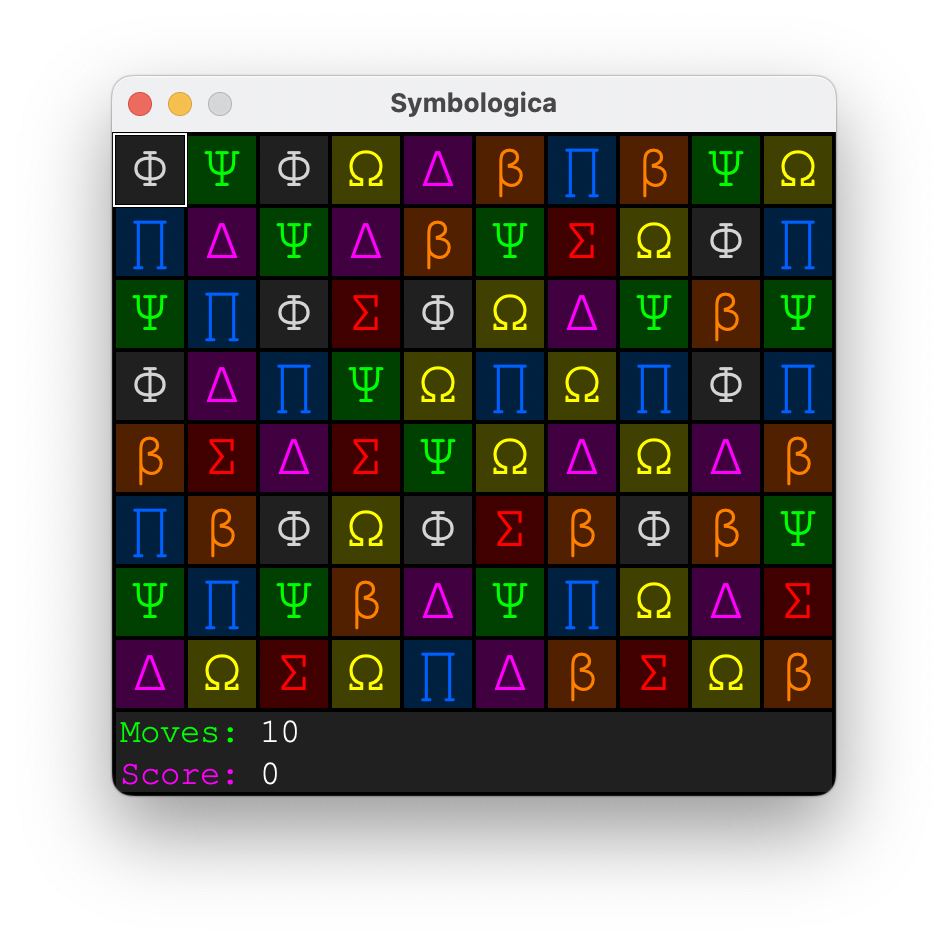
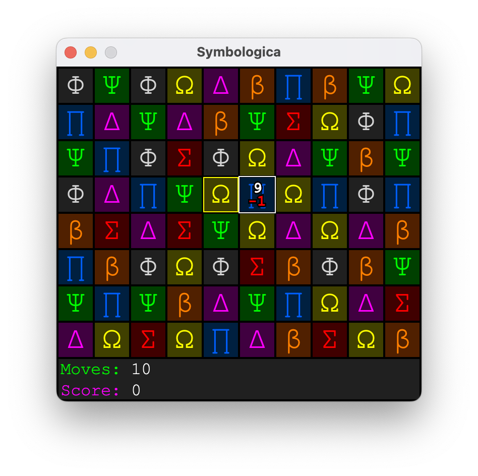
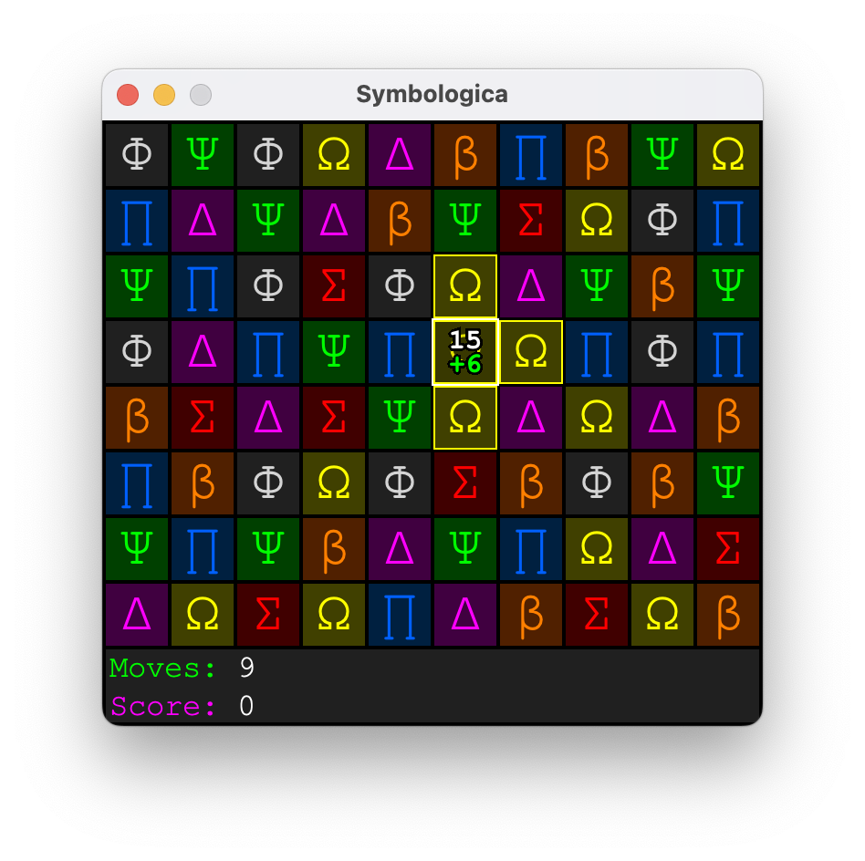
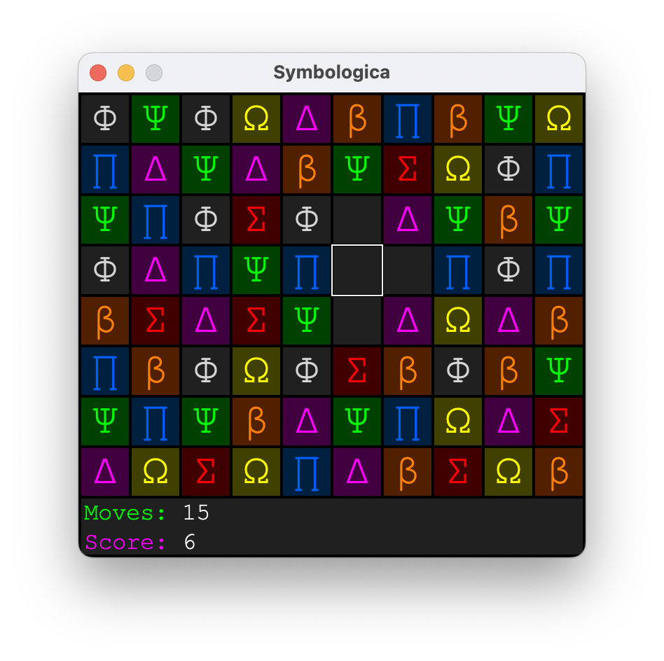
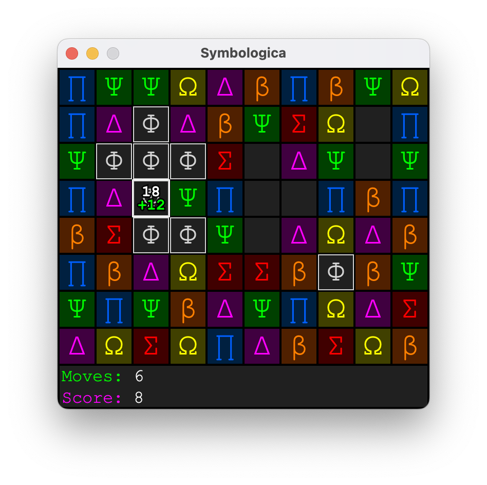
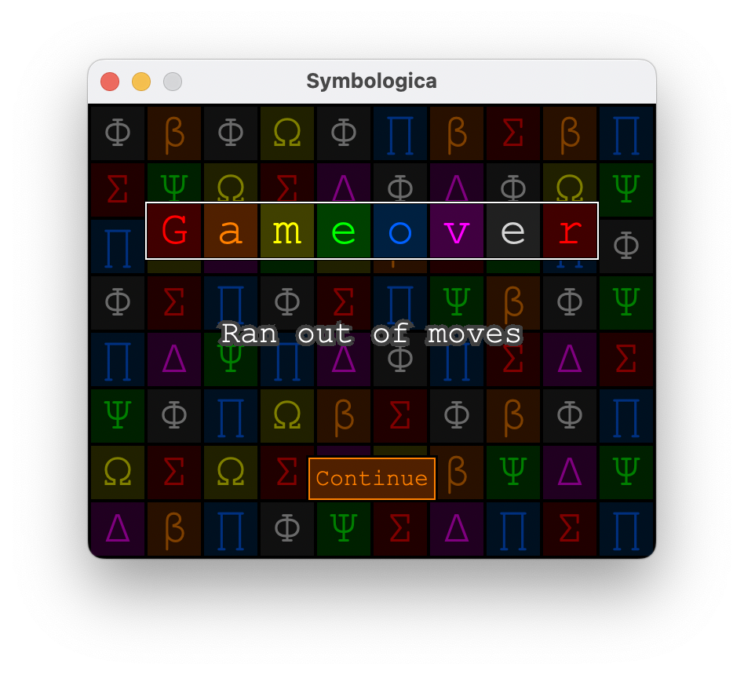

# Symbologica

Symbologica is a puzzle game where the primary feature is swapping tiles to create matching sets of adjacent symbols that are then cleared. Swaps cost you moves, and clearing sets gain back moves. The goal is to clear as many tiles as possible before running out of moves.

## Dependencies

- Java 17
- Maven

## Gameplay

### Title Screen

The title screen simply displays the title of the game. Press the `start` button to begin a new game. 




### Moving the Cursor

Press `Start` to begin a new game. This loads the game board. Use the arrow keys or mouse to navigate the cursor. (The white square.)



### Swapping Tiles

The purpose of the game is to swap tiles and clear sets of adjacent tiles until the board is empty, after which a new screen of tiles is then loaded. To swap tiles, first press use the `action` command (by pressing `enter`, `spacebar`, or `x`, or by right-clicking the mouse) to select a tile, and then use the `action` command over a different tile to swap those two tiles.

After a tile is selected, moving the cursor over another tile displays your new moves value after the swap as a number in white, and the modifier to your moves as a number in red drawn in the cursor.




### Deselecting a Tile

To remove your present selection, use an `action` key command on that tile, press `escape`, or right click the mouse on that tile and it will be deselected.

### Adjacency Sets

Once two or more tiles are adjacent, they become an adjacency set. Tiles in sets can no longer be swapped. Instead, moving the cursor over a set displays your new moves value if you were to clear the set now as a number drawn in white, and the modifier to your moves as a number drawn in green.

The entire adjacency set will also be highlighted in its color, to show all tiles presently in that set that will be cleared if the `action` command is executed against it.



### Clearing a Set

Once a set is cleared, the tiles disappear. Now a new tile can be selected for a swap, or further adjacency sets can be cleared. Your move count will go up by the modifier to your score. Which is equal to the following formula:

`modifier = tileCount * 2 - 2`

Sets of size two only give `2` moves. But sets with more tiles give an additional bonus of `+1` for each successive tile in the set. So sets of size three give `3 + 1 = 4` moves, while sets of size four give `4 + 2 = 6` moves, and so on.



### Orphaned Tiles

If clearing a set would orphan a tile—meaning there is only one tile left afterwards, which could not be cleared with a later set—that tile will flash with an outline to warn the player that an orphaned tile would then exist, which is a gameover condition. Clearing the set despite this will result in a gameover.



### Gameover

The game ends if you either run out of moves after making a swap, or if you create an orphaned tile after clearing an adjacency set. This displays a gameover screen, with a `continue` button that takes you back to the title screen.



## Build and Run

Run the following commands in the terminal to build and run the game:

```zsh
mvn install
java -jar target/Symbologica-0.2.5.jar
```
